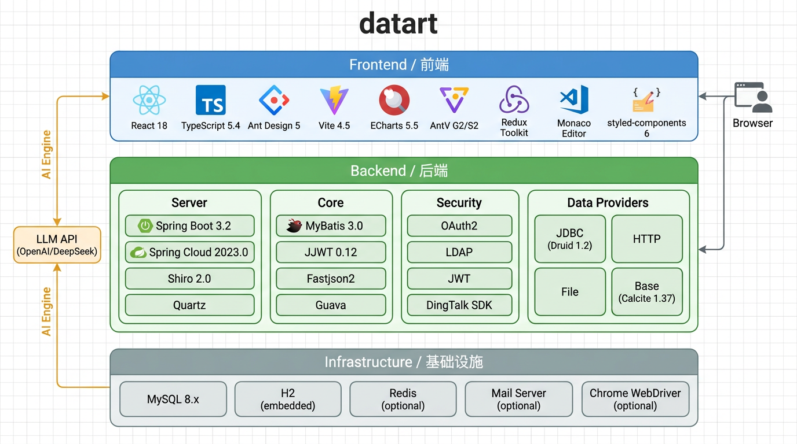

> **新一代数据可视化开放平台，支持报表、仪表板、大屏、分析和可视化数据应用的敏捷构建。**

## What is datart?

datart 是新一代数据可视化开放平台，支持各类企业数据可视化场景需求，如创建和使用报表、仪表板和大屏，进行可视化数据分析，构建可视化数据应用等。由原 davinci 主创团队出品，datart 更加开放、可塑和智能，并在数据与艺术之间寻求最佳平衡。

### 设计理念

- **开放 Openness**：基于 Source > View > Chart > Visualization 建立标准化的受管控数据可视化应用开发流程，支持插件化扩展
- **可塑 Integrability**：可独立运行，也可嵌入第三方系统，提供登录/权限/数据源/可视化 SDK 对接能力

---

## 技术架构



## 数据架构

datart 的数据模型分为数据资产、可视化应用、组织权限和运行元数据四个层次。各层通过稳定的资源 ID 和关系表关联，数据内容与字段元数据分离保存。

```text
组织与权限域
Organization
├── User ── OrganizationMember
├── Role ── UserRole
└── RoleResourcePermission
    ├── Source / View / Datachart / Dashboard
    ├── 行权限、变量权限
    └── 列权限

数据资产域
Source（数据源连接与类型）
├── SourceSchema（数据源结构缓存）
└── View（结构化视图或 SQL 视图）
    └── ViewField（规范化字段元数据）
        ├── fieldId / canonicalKey
        ├── originName / displayName
        ├── sourceComment / sourcePath
        ├── fieldType / fieldCategory
        └── expression / ordinal / active

可视化应用域
View
└── Datachart（图表配置，字段通过 fieldId 关联 ViewField）
    └── Dashboard
        └── Widget（组件、布局、筛选、联动和嵌入关系）
```

### 数据查询链路

```text
React 前端
    ↓ REST API
Server Controller / Service
    ↓
Data Provider
    ├── JDBC：MySQL、StarRocks、Doris、PostgreSQL 等
    ├── HTTP：HTTP API 数据源
    └── File：CSV / Excel 数据源
    ↓
数据源执行查询 → 结果集与字段类型 → 图表 / 表格 / 仪表板渲染
```

`ViewField` 是当前运行时的规范字段元数据来源：图表字段优先通过 `fieldId` 解析到对应 ViewField，再使用字段的显示名称、物理来源和类型信息。SQL 视图保存或迁移时，会根据 SQL 输出字段和物理字段注释补充 lineage；表达式字段无法确认来源时保持保守，不根据字段名猜测注释。

### 元数据升级与兼容架构

```text
旧资源包 V1 / 当前资源
        ↓
资源格式识别与兼容读取
        ↓
View / ViewField 规范化与 reconcile
        ↓
Readiness Scanner
        ├── READY / WARNING / BLOCKER
        ├── fieldId coverage
        └── resolved fieldId coverage
        ↓
Organization MigrationMode
        ├── COMPAT：允许历史无 fieldId 资源兼容解析
        └── STRICT：只允许 canonical fieldId，失败时明确报错
```

数据库升级由项目内置 `DatabaseMigration` 执行，脚本位于 `server/src/main/resources/db/migration/`，当前包含 V1–V6。迁移历史记录在 `migration_history` 表中；该机制不是运行时依赖 Flyway。

---

## 技术栈总览

### 后端（Backend）

| 分类 | 技术 | 版本 | 说明 |
|------|------|------|------|
| **运行时** | Java | 17 | LTS 版本，需 `--add-opens` 参数支持反射 |
| **核心框架** | Spring Boot | 3.2.12 | Jakarta EE 命名空间（javax → jakarta） |
| **微服务** | Spring Cloud | 2023.0.4 | 与 Spring Boot 3.2 配套 |
| **ORM** | MyBatis Spring Boot Starter | 3.0.4 | 适配 Spring Boot 3 |
| **安全** | Apache Shiro | 2.0.2 | 认证与授权 |
| **安全** | Spring Security OAuth2 | 6.x（Boot 管理） | OAuth2 客户端 + JWK/JWT |
| **JWT** | JJWT | 0.12.6 | HMAC / RSA / EC 全支持 |
| **JWT** | jose4j | 0.7.12 | JWK 解析 |
| **JWT** | java-jwt (Auth0) | 4.4.0 | 辅助 JWT 操作 |
| **加密** | BouncyCastle | 1.79（jdk18on） | PEM / 证书解析 |
| **连接池** | Druid Spring Boot 3 Starter | 1.2.24 | 数据库连接池 + 监控 |
| **JSON** | Fastjson2 | 2.0.57 | 高性能 JSON 序列化（safeMode 已开启） |
| **JSON** | Jackson | Boot 管理 | REST 序列化主力 |
| **SQL 解析** | Apache Calcite | 1.42.0 | SQL 方言转换与优化 |
| **SQL 格式化** | sql-formatter (Java) | 2.0.1 | SQL 美化输出 |
| **JS 引擎** | GraalVM JavaScript | 22.3.5 | 替代 Nashorn，执行 parser.js |
| **缓存** | Spring Data Redis | Boot 管理 | 可选缓存层 |
| **目录服务** | Spring Data LDAP | Boot 管理 | 可选 LDAP 登录 |
| **定时任务** | Quartz | Boot 管理 | JDBC 存储，集群安全 |
| **邮件** | Spring Boot Mail | Boot 管理 | 注册激活 / 报表推送 |
| **模板** | Thymeleaf | Boot 管理 | 邮件 / 分享页模板 |
| **API 文档** | SpringDoc OpenAPI | 2.5.0 | Swagger UI（/v3/api-docs） |
| **HTTP 客户端** | Apache HttpClient | 4.5.14 | 通用 HTTP 请求 |
| **数据库驱动** | MySQL Connector-J | 8.0.33 | 主数据库驱动 |
| **内嵌数据库** | H2 | Boot 管理 | 开发/Demo 模式 |
| **文档处理** | Apache POI | 5.2.5 | Excel 导入导出 |
| **文档处理** | PDFBox | 2.0.31 | PDF 生成 |
| **截图** | Selenium | 4.15.0 | 图表/仪表板截图 |
| **图片** | Thumbnailator | 0.4.14 | 缩略图生成 |
| **工具** | Guava | 32.1.3-jre | 集合 / 缓存 / 并发工具 |
| **工具** | Apache Commons Lang3 | 3.14.0 | 字符串 / 对象工具 |
| **工具** | Apache Commons IO | 2.15.1 | 文件 IO 工具 |
| **工具** | Apache Commons CSV | 1.8 | CSV 解析 |
| **工具** | Lombok | 1.18.30 | 编译时代码生成 |
| **第三方集成** | DingTalk SDK | 1.1.86 | 钉钉登录 |
| **构建** | Maven | 3.6+ | 多模块构建，含 assembly 打包 |

### 前端（Frontend）

| 分类 | 技术 | 版本 | 说明 |
|------|------|------|------|
| **核心** | React | ^18.2.0 | UI 框架 |
| **类型系统** | TypeScript | 5.4.5 | 静态类型检查 |
| **UI 组件库** | Ant Design | ^5.22.0 | 企业级组件（CSS-in-JS） |
| **图标** | @ant-design/icons | ^5.6.1 | Ant Design 图标库 |
| **高级组件** | @ant-design/pro-components | ^2.8.6 | 表格/表单/布局高级组件 |
| **状态管理** | Redux Toolkit | ^2.0.0 | 全局状态管理 |
| **状态绑定** | react-redux | ^9.0.0 | React-Redux 绑定 |
| **路由** | react-router-dom | ^6.22.0 | SPA 路由 |
| **图表** | ECharts | ^5.5.0 | 主力可视化图表库 |
| **图表** | @antv/g2 | ^5.4.8 | AntV 可视化语法 |
| **表格** | @antv/s2 + s2-react | ^2.1.0 | 透视表 / 多维分析表 |
| **代码编辑器** | Monaco Editor | ^0.45.0 | SQL 编辑器 |
| **样式** | styled-components | ^6.1.0 | CSS-in-JS 样式方案 |
| **HTTP** | Axios | ^1.7.0 | HTTP 请求 |
| **国际化** | i18next + react-i18next | ^23 / ^14 | 多语言支持 |
| **拖拽** | @hello-pangea/dnd | ^16.6.0 | 拖拽排序 |
| **布局** | react-grid-layout | ^1.2.4 | 仪表板网格布局 |
| **虚拟滚动** | react-window | ^1.8.6 | 大列表/大表格虚拟滚动 |
| **富文本** | react-quill-new | ^3.3.0 | 富文本编辑器 |
| **构建工具** | Vite | ^4.5.14 | 开发服务器 + 生产构建 |
| **测试** | Vitest | ^0.34.6 | 单元测试框架 |
| **CSS 方案** | Less | ^4.8.1 | Ant Design 主题定制 |
| **Node 要求** | Node.js | ≥ 18.0.0 | 构建运行时 |

### 基础设施（Infrastructure）

| 组件 | 版本要求 | 说明 |
|------|---------|------|
| **JDK** | 17+（推荐 Eclipse Temurin） | 运行/构建环境，可内嵌打包 |
| **MySQL** | 5.7+（推荐 8.x） | 主数据库 |
| **H2** | 内嵌（Boot 管理） | 开发/Demo 模式内置 |
| **Redis** | 可选 | 缓存层 |
| **邮件服务器** | 可选 | 注册激活 / 报表推送 |
| **Chrome WebDriver** | 可选（Selenium 4.15） | 截图服务 |
| **Docker** | 可选 | 容器化部署（基础镜像 eclipse-temurin:17-jre） |

---

## 模块结构

```
datart
├── core/                    # 核心模块：实体、Mapper、数据模型、数据库迁移基础设施
├── security/                # 安全模块：认证、授权、OAuth2、JWT、LDAP、钉钉登录
├── data-providers/          # 数据源适配层
│   ├── data-provider-base/  #   基础层：Calcite SQL 解析、变量系统
│   ├── jdbc-data-provider/  #   JDBC 数据源（MySQL/StarRocks/Doris/PostgreSQL...）
│   ├── http-data-provider/  #   HTTP API 数据源
│   └── file-data-provider/  #   文件数据源（CSV/Excel）
├── server/                  # 服务端：Controller、Service、定时任务、迁移脚本与安装包组装
├── frontend/                # 前端：React SPA（4 个入口：main/shareChart/shareDashboard/shareStoryPlayer）
├── config/                  # 配置文件
├── bin/                     # 启动/停止脚本
└── docs/                    # 文档
```

---

## 功能特性

- **数据源管理**：支持 JDBC（MySQL/StarRocks/Doris/PostgreSQL 等）、HTTP API、文件（CSV/Excel）多种数据源
- **数据视图**：SQL 模式 / 结构化视图模式，支持变量、缓存、权限变量
- **图表可视化**：ECharts + AntV 双引擎，40+ 内置图表类型，支持插件扩展
- **仪表板**：拖拽式布局、筛选/联动/钻取/跳转、定时推送
- **数据分析**：透视表（S2）、多维分析
- **权限体系**：组织-角色-资源三级权限模型，行级/列级数据权限
- **分享与嵌入**：仪表板/图表独立分享链接，支持 iframe 嵌入第三方系统
- **多语言**：中文 / 英文国际化
- **数据库自动迁移**：内置 DatabaseMigration 管理 V1–V6 Schema 版本，升级零手动 SQL

---

## 快速开始

### 环境要求

- JDK 17+
- Node.js 18+
- MySQL 5.7+（或使用内置 H2）
- Maven 3.6+

### 构建

```bash
# 完整构建（前端 + 后端）
mvn clean package -DskipTests

# 仅后端
mvn clean package -DskipTests -pl server -am

# 仅前端
cd frontend && npm install --legacy-peer-deps && npm run build:all
```

### 运行

```bash
# 独立模式（内置 H2）
./bin/datart-server.sh start

# Docker
docker run -p 8080:8080 datart/datart
```

启动后访问 http://127.0.0.1:8080，默认用户 `demo / 123456`。

### 配置外部数据库

编辑 `config/datart.conf` 和 `config/profiles/application-config.yml`，配置 MySQL 连接信息。

---

## 在线体验

> http://datart-demo.retech.cc
>
> 用户名：demo ｜ 密码：123456

---

## 社区与支持

- **问题反馈**：[GitHub Issues](https://github.com/running-elephant/datart/issues)
- **插件示例**：[datart-extension-charts](https://github.com/running-elephant/datart-extension-charts)
- **用户列表**：[Adopters](https://github.com/running-elephant/datart/issues/137)

---

## License

datart is under the Apache 2.0 license. See the [LICENSE](./LICENSE) file for details.
